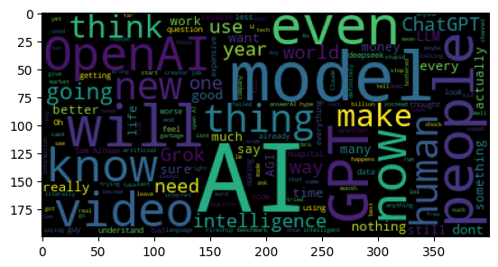

# Ai Sentiment Analysis

# About the project
In the world of artificial intelligence, people have different opinions about it. In this project, we will analyze the sentiment of comments about AI using two popular videos about GPT and Gemini.

# Youtube Resources
Video from YouTube channel [Fireship](https://www.youtube.com/@Fireship)
- [Video about GPT](https://youtu.be/FW2XOIxaNqg?si=jaz2trhQh1VZCgQD)
- [Video about Gemini](https://youtu.be/k9xbh9LUYn0?si=Xri8VEv4VPAFk2FX)

# Getting comments from videos
The first step is to get the YouTube Data API v3 from [Google Cloud Console](https://console.cloud.google.com/).

Next installing a library for working with YouTube:
``` python
pip install google-api-python-client
```
commentThreads().list() — API method for getting a list of comments for a given video (videoId=video link).

The comments may contain emojis, Cyrillic and other non-ASCII characters, so we will remove them.
``` python
def remove_emojis(text):
    return re.sub(r'[^\x00-\x7F]+', '', text)
```
Next create a dataframe with our received comments, apply the remove_emojis function and remove spaces
``` python
df = pd.DataFrame(comments, columns=['comments'])
df['comments'] = df['comments'].apply(remove_emojis)
df = df[df['comments'].str.strip() != '']
df.head()
```
|       | comments                                                                 |
|-------|--------------------------------------------------------------------------|
| 0     | The greatest innovation OpenAI can make is to ...                        |
| 1     | Yes, I also hear like this when it just release                          |
| 2     | I'm using 4.5 for interpreting case law, it's ...                        |
| 3     | 0:23 best movie ever lmao                                                |
| 4     | Q tristeza                                                             |

# Model
The analysis will be conducted using a trained model from [HuggingFace](https://huggingface.co/).
The trained model used [cardiffnlp/twitter-roberta-base-sentiment](https://huggingface.co/cardiffnlp/twitter-roberta-base-sentiment)

# About Twitter-roBERTa-base for Sentiment Analysis
This is a roBERTa-base model trained on ~58M tweets and finetuned for sentiment analysis with the TweetEval benchmark. This model is suitable for English (for a similar multilingual model, see XLM-T).

Labels: 0 -> Negative; 1 -> Neutral; 2 -> Positive

# Sentiment Analysis
Before starting the analysis, let's convert the comments column into a list
``` python
comments_list = df['comments'].tolist()
```
Next, we will create an object to use for sentiment analysis
``` python
pipe = pipeline('sentiment-analysis', model='cardiffnlp/twitter-roberta-base-sentiment', truncation=True, max_length=512)
```
We will provide the created object with comments for sentiment analysis.
``` python
results = pipe(comments_list)
sentiment = [result['label'] for result in results]
```
Add a new column 'sentiment' to the df
``` python
df['sentiment'] = sentiment
df.head()
```
| Comments                                         | Sentiment |
|-------------------------------------------------|-----------|
| The greatest innovation OpenAI can make is to ... | LABEL_2   |
| Yes, I also hear like this when it just release | LABEL_1   |
| I'm using 4.5 for interpreting case law, it's ... | LABEL_2   |
| 0:23 best movie ever lmao                       | LABEL_2   |
| Q tristeza                                      | LABEL_1   |

Turn labels into understandable values
``` python
df['sentiment'] = df['sentiment'].map({'LABEL_0':'negative', 'LABEL_1': 'neutral', 'LABEL_2':'positive'})
```

We do the same operation for the video about Gemini.

- [GPT Analysis](./gpt_sentiment.ipynb)
- [Gemini Analysis](./gemini_analysis.ipynb)

# Sentiment of comments on artificial intelligence
The most interesting part of the project is how people really relate to the development of AI and individual famous AIs.

The following distribution of sentiments is observed in the GPT:


Most people are neutral. But what's more interesting is that the number of **negative comments is much higher than the number of positive comments**.
Let's see what exactly this is connected with.

Use WordCloud to see which words are used most often in negative comments


In the picture we can see the word "work" and "job". Obviously there are comments that say that AI will replace people and their jobs. Nobody will be happy with that.
There are some bad words, which suggests that people really have a negative attitude towards GPT. There is also the word "price" which says that people are not satisfied with the price.
It's interesting that there's also the word "hype." Some people are just tired of hearing about AI every day.

# Why is there an analysis with Gemini?
I was really surprised by the number of negative comments, which significantly outnumbered the positive ones. I thought that maybe it was because people didn't like the GPT, not the AI. That's why I did the same analysis with the comments under the video about Gemini.


Positive sentiment has increased, but negative sentiment remains. 
Let's see what words are most popular in negative comments.


The situation remains the same as in WordCloud with GPT.

You can also look at WordClouds with positive comments: [IMG folder](./img)

# Conclusion

It's wrong to say that people don't like AI based on just two videos. But if we talk about the almost 2k comments I got from the video, the majority are neutral towards artificial intelligence. A fair number of people don't like AI for various reasons: price, job replacement, excessive hype. But there are also people who definitely like AI. 

**Thanks for reading!**
